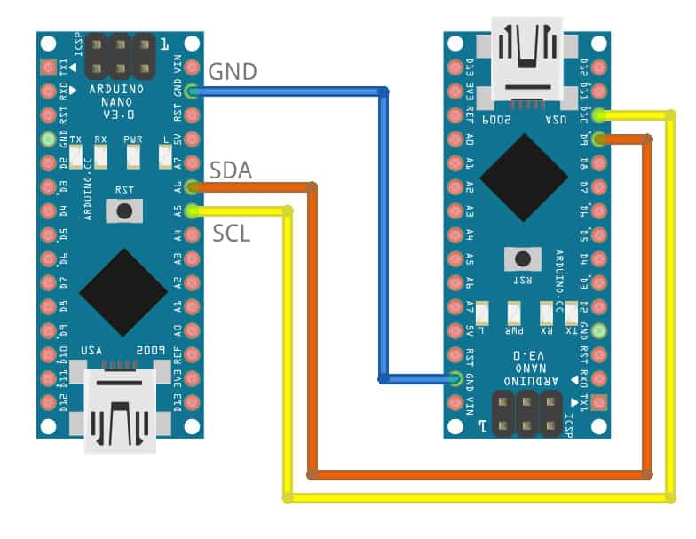

# Programming Cookbook Recipe: I2C Communication

## Problem

I have 10 arduinos and they all need to be connected to each other. Thats too many wires.
When making more complex circuits connecting each component to a microprocessor connecting each individually can take a lot of wires and GPIO pins. This problem can be solved using I2C.

## What is I2C

I2C, which stands for Inter-Integrated Circuit, is a widely used communication protocol in the world of electronics and embedded systems. It is designed to facilitate data transfer between various components on a circuit board or between different devices in a system. The max effective range of I2C is around 1m. This Could pose an issue if we decide to use this to facilitate communication in the cyber range. I2C operates on a master-slave architecture, where one or more master devices control and initiate communication with multiple slave devices, allowing them to exchange data using a two-wire serial interface. Its simplicity and versatility make it a popular choice for connecting sensors, memory modules, displays, and other peripherals in a arduino projects.

## Solution to our problem

This recipe provides comprehensive code snippets and step-by-step procedures for setting up and utilizing I2C communication effectively.

To setup I2C you need to connect the SCL (Serial Clock) and SDA (Serial Data) Wires on both Arduino's together hence the name two-wire serial interface. The Ground line of any arduino you use have to share the same ground line as well.



Code for the Master:

```c++
#include <Wire.h>

int x = 0;
void setup() {
  Wire.begin(); 
  pinMode(13, OUTPUT);
  Serial.begin(9600);
}

void loop() {
  digitalWrite(13, HIGH);
  if (Serial.available() > 0) 
  {
    Wire.beginTransmission(9);
    while(Serial.available() > 0)
    {
      int incomingByte = Serial.read();

      Serial.print("Sending: ");
      Serial.println(incomingByte, DEC);

      Wire.write(incomingByte);   
    }
    // sends x 
    Wire.endTransmission(); 
    }
}
```

Code for the Slave:

```c++
#include <Wire.h>
#include <string.h>

#define LED 13


char buffer[40];
int messagePosition = 0;
int isReady = 0;

void setup() {
  pinMode(LED, OUTPUT);
  digitalWrite(LED, HIGH);

  Serial.begin(9600);

  Wire.begin(9); 
  Wire.onReceive(receiveEvent);
}

void receiveEvent(int howMany)
{
  Serial.print("Recived: ");
  Serial.print(howMany);
  Serial.print(" Byte/s \nAt position: ");
  Serial.println(messagePosition);

  int temp = Wire.read();  
  buffer[messagePosition] = temp;
  messagePosition += 1; 

  if(temp  == 10)
  {
    messagePosition = 0; 
    isReady = 1;
  }
}

void loop() {
  if(isReady == 1)
  {
    Serial.println(buffer);

    if(strncmp(buffer, "LED", 3) == 0)
    {
      digitalWrite(LED, !digitalRead(LED));
      Serial.println("Switching led state");
    }

    memset(buffer,0, 40);
    isReady = 0;
  }
}
```

#### What does this code do?

##### For the Master

```c++
#include <Wire.h>

int x = 0;
void setup() {
  Wire.begin(); 
  pinMode(13, OUTPUT);
  Serial.begin(9600);
}
```

This code Begins a I2C connection as a Master (Because it has no argument), then it sets the Pin 13 to be an output pin, and finally it begins a serial (UART) connection through the usb port to your computer.

```c++
void loop() {
  digitalWrite(13, HIGH);
  if (Serial.available() > 0) 
  {
    Wire.beginTransmission(9);
    while(Serial.available() > 0)
    {
      int incomingByte = Serial.read();

      Serial.print("Sending: ");
      Serial.println(incomingByte, DEC);

      Wire.write(incomingByte);   
    }
    // sends x 
    Wire.endTransmission(); 
    }
}
```

This code will run in a loop forever and first it will turn on the LED connected to Pin 13 to high. This means that if it does not turn on something has broken in the previous step (most likely the usb has come unplugged and it cannot open a serial connection). Then i twill check for any incoming messages over the Serial connection, and if there is it will start a message on the I2C line to the Slave with address 9. Once it has begun a transmission it will send all bytes from serial over the I2C lines printing each byte as a decimal number back to the serial connection. Finally once the whole message has been *sent* it will end the transmission. (note Wire.endTransmission() is the actual function that sends the messages not Wire.write() )

##### Now for the Slave

```C++
#include <Wire.h>
#include <string.h>

#define LED 13


char buffer[40];
int messagePosition = 0;
int isReady = 0;

void setup() {
  pinMode(LED, OUTPUT);
  digitalWrite(LED, HIGH);

  Serial.begin(9600);

  Wire.begin(9); 
  Wire.onReceive(receiveEvent);
}
```

This code is very similar to the code for the master except the begin function has an argument, this makes it into a slave on address 9. It also has an onReceive this takes a function to be called every time a new messages it being received. the variables buffer messagePosition and isReady will be used later.

```c++
void loop() {
  if(isReady == 1)
  {
    Serial.println(buffer);

    if(strncmp(buffer, "LED", 3) == 0)
    {
      digitalWrite(LED, !digitalRead(LED));
      Serial.println("Switching led state");
    }

    memset(buffer,0, 40);  
    isReady = 0;
  }
}
```

This loop will continually check if the isReady variable if it is true (not ideal). If this flag is set it will print out the contents of the buffer array and use strncmp (String N compare [See More](https://www.tutorialspoint.com/c_standard_library/c_function_strncmp.htm) ) to and compare it against "LED" if they both match it will change to LED pin to what it is not (on if its off, off if its on), then print a message to the *Slaves* serial connection. Finally it will set the isReady flag to false and write 0 to all values in buffer.

**Now for the hard part**

```C++
void receiveEvent(int howMany)
{
  Serial.print("Recived: ");
  Serial.print(howMany);
  Serial.print(" Byte/s \nAt position: ");
  Serial.println(messagePosition);

  int temp = Wire.read();  
  buffer[messagePosition] = temp;
  messagePosition += 1; 

  if(temp  == 10)
  {
    messagePosition = 0; 
    isReady = 1;
  }
}
```

```C++
  Serial.print("Recived: ");
  Serial.print(howMany);
  Serial.print(" Byte/s \nAt position: ");
  Serial.println(messagePosition);
```

This will print out how many bytes have been received (Our master will only send 1 byte at a time).

```c++
  int temp = Wire.read();  
  buffer[messagePosition] = temp;
  messagePosition += 1; 
```

This will read the first incoming byte and set it into the buffer array at messagePosition then increment messagePosition. Remember that we are sending 1 byte at a time but if you decide to send multiple at once this code will only read the first byte.

```C++
  if(temp == 10)
  {
    messagePosition = 0; 
    isReady = 1;
  }
```

All our serial messages from our computer terminate with a '\n' this is char of value 10 or a newline, this means that once we receive this we know that the message is over, and when we receive the next message we should start writing from the start of the buffer.

> Another possibility of using \n to terminate messages is that we can use \0 as a delimiter at set intervals to automatically split out buffer array into multiple Null-terminated strings and use pointers for a basic version of packets.
> Example (not real data):
> |---------|  |-| |--------------------------|
> 2, 20, 0, 0, 28, 4, 32, 73, 99, 0, 83, 93, 10
> And if we set beforehand that first 4 bytes are for the address, next is for packet index, then the rest is data. Preset pointers can then read these bytes as null terminated stopping at the 0, giving us more data in out packets.

## InDepth Explanation of I2C

- Master-Slave Architecture:
  1 Master Multiple Slaves is the normal configuration for I2C but it is not restricted to this.

  - Masters: In an I2C system, there can be one or more master devices. Masters initiate and control communication on the bus.
  - Slaves: There can be multiple slave devices. These devices respond to commands from the master(s) and can be various components like sensors, memory chips, or displays.
- Two-Wire Communication:

  I2C uses a two-wire serial communication bus: SDA (Serial Data Line) and SCL (Serial Clock Line).
  SDA carries the actual data, while SCL carries the clock signal, synchronizing data transfer between devices.
  This means that only 1 device can transfer data at once, again this could pose a data limit throughput issue if we use I2C to make the cyber range
- Start and Stop Conditions:

  Communication begins with a Start condition (S) and ends with a Stop condition (P).
  A Start condition indicates that a transaction is beginning, and a Stop condition signals the end.
- 7-Bit Device Addressing:

  Each I2C device is identified by a 7-bit address, allowing for up to 128 unique addresses.
  Some reserved addresses are used for special purposes.
  The device address can sometimes be non configurable on some cheaper devices meaning there is a limit of 1 of this device on the line at once. This is a considerable issue that cannot be ignored. (The ultrasonic sensor is one of these devices)
- Data Transfer:

  Data is transferred in 8-bit bytes.
  After the Start condition, the master sends the 7-bit device address along with a read/write (R/W) bit indicating whether it wants to read (R) from or write (W) to the device.
  The addressed slave acknowledges the request.
- Acknowledgment (ACK):

  After each byte of data (including the device address), the receiving device sends an ACK or NACK (Not Acknowledged) bit to acknowledge the data receipt.
  This mechanism ensures error checking and reliable communication.
- Clock Synchronization:

  The SCL line generates clock pulses that both the master and slave devices use to synchronize data transfer.
  Data is sampled on the rising or falling edge of the clock, depending on the device's specifications.

## **UART as an Alternative**

Another alternative to I2C is UART or Universal Asynchronous Receiver-Transmitter this is a common alternative to I2C as it is used to upload code to Arduinos. UART can have a longer range than I2C which is limited to around 1m, while UART can be as high as 10m. The main limitation of UART is no capability for master and slave setups that I2C excels at. This can be an issue with a UART device and an arduino when new code needs to be uploaded to the arduino.

## Examples

I2C is essential in project where you have many devices connected to 1 mainboard. It reduces the number of wires you need to run and simplifying circuits and designs.

I2C can also become the backbone of the future cyber range as we have can have many devices controlled  by 1 or a few mainboards (raspberry pi) that can facilitate all of the actions that need to be done, like opening a gate, turning on a wind turbine, or changing the tracks for a train.

Another application of I2C is modules for group projects where everyone develops and makes one module of a larger whole without needing everyone's module to also work. I.E your part work whether of not the rest of your groups works. This will avoid groups where 1 person does all the work (unless that person really wants to see their project built).

---
